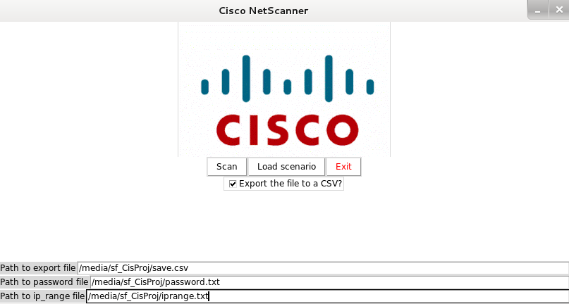
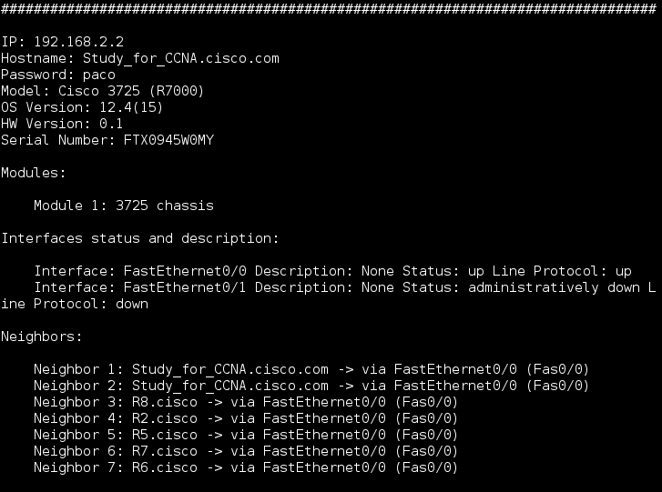
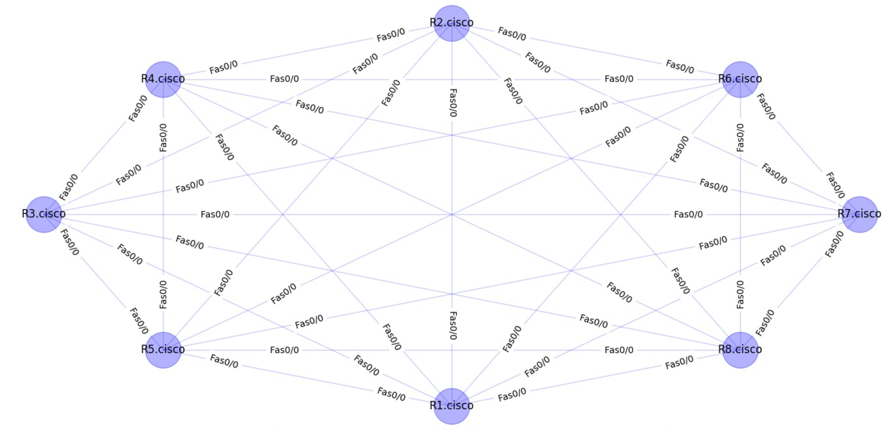

# Cisco_Python_Project

The aim of this project is providing a software solution to the following issues:

1.	Knowing all available devices in the network. For each device, is needed to know:
  -	Hardware version.
  -	OS version running on the device.
  -	Management IP address.
  -	Password.
  -	Modules which are installed on the device - and status of each module.
2.	Topology
3.	Seeing the interface description and interface status for each interface on each device. 
4.	Designing a tool which will be able to report end of life/end of support for the available hardware/OS in the network. 

For this purpose, we have designed a graphic interface. The interface will look like this:
# 

First of all, is needed to attach two files (the path has to be the absolute one, name of the file included):
  1. The first file is <i>password.txt</i> (the name cannot be changed). This file must contain all passwords of all          devices in the network. In order to be read properly, there must be just one password per line. A good example of a <i>password.txt</i> could be:
   password1  
  password2  
  password3
  
  2. The second file needed to run our application is the <i>iprange.txt</i> file (like the other one, the name cannot be changed). This file must contain the iprange of the network plus the mask (all IPs can be in the same line but separated by commas). The structure of this file must be like the following (ip/mask, ip2/mask2, etc...):
   192.168.2.0/24, 192.168.3.0/24
  
After providing all the information above, we can run the application by clicking on the <i>Scan</i> button.
 
The application will start its scan of the network printing via console all the information related with the devices found. 
An example of this output can be the following picture:

# 

In addition, the application will display a topology map through a GUI. This map will show all devices and all the connections with the other ones. It will also be possible to see the names of all used interfaces. This map will be similar to the following one:

# 

# Other features

This software also provides two more functionalities:

  1. It is also possible to export the data of all devices in a csv file. For this purpose, it is necessary to provide the          absolute path (including the name of the file.csv) where the file will be saved in the <i>Path to export</i> field. After      providing this path the user must click on the <i>Scan</i> button and the application will run displaying all the data        previously mentioned. 
  2. Another important feature is the possibility of doing the opposite process. This means to import a csv file and process it in order to display all the devices data and the topology map. For this purpose, it is necessary to provide the location of the csv file in the <i>Path to export</i> filed (absolute path + name of the file) and click on the <i>Import</i> button.
